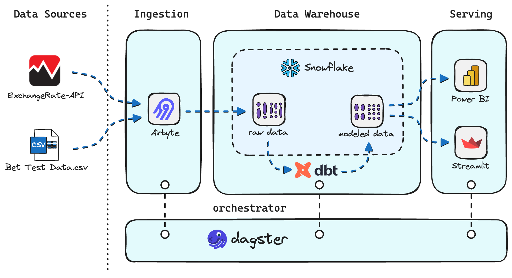

# Betting Data Pipeline Project

Welcome to the **Betting Data Pipeline** project! This repository showcases an end-to-end data analytics stack to ingest and transform betting data, convert amounts from USD to BRL, and report the results via Power BI and Streamlit.

---

## Table of Contents

1. [Project Overview](#project-overview)  
2. [Key Components](#key-components)  
3. [Architecture Diagram](#architecture-diagram)  
4. [Getting Started](#getting-started)  
   - [Prerequisites](#prerequisites)  
   - [Repo Structure](#repo-structure)  
   - [Local vs. Cloud Deployment](#local-vs-cloud-deployment)  
5. [How Data Flows](#how-data-flows)  
6. [CI/CD with Dagster Cloud](#cicd-with-dagster-cloud)  
7. [Additional Documentation](#additional-documentation)  

---

## Architecture Diagram



---

## Project Overview

We have a **betting dataset** that needs to be:
1. Ingested from a CSV and external API into **Snowflake** via **Airbyte** (raw schema).  
2. Transformed with **dbt** into staging and star-schema tables (marts).  
3. Orchestrated with **Dagster** (which schedules and triggers Airbyte syncs + dbt runs).  
4. Reported with both **Power BI** (for advanced analytics) and **Streamlit** (for an interactive dashboard).

---

## Key Components

- **Airbyte**: Extracts betting data (and exchange rates) and loads it into Snowflake.  
- **Snowflake**: Cloud data warehouse to store both raw and transformed data.  
- **dbt**: Transforms raw data into staging and marts, creating fact/dim tables.  
- **Dagster**: Orchestrates the entire pipeline (Airbyte -> dbt -> final state).  
- **Streamlit**: Interactive Python dashboard, reading directly from Snowflake.  
- **Power BI**: Another front-end for BI reporting (PBIX file).

---

## Getting Started

### Prerequisites

- **Python** 3.8+  
- **Docker** (for local Airbyte)  
- **Snowflake** account or trial  
- **dbt** (installed via `pip` or `pipenv`/Poetry)  
- **Dagster** (local or Dagster Cloud account)  
- **Power BI** desktop (optional, for local dev)

### Repo Structure

```bash
.
├── .github/workflows/  # CI/CD via GitHub Actions -> Dagster Cloud
├── airbyte/            # Airbyte config & custom connector
├── analytics/          # dbt project (models, seeds, snapshots, etc.)
├── orchestrator/       # Dagster code (assets, jobs, schedules)
├── power_bi/           # Power BI dashboard file
├── streamlit/          # Streamlit dashboard code
├── snowflake/          # SQL scripts for setting up roles/users
├── ...
└── README.md           # This file
```

### Local vs. Cloud Deployment

- **Airbyte**: You can run locally via Docker (see [airbyte/README.md](./airbyte/README.md)) or use Airbyte Cloud.  
- **Dagster**: The code is set up for **Dagster Cloud**. You can still run locally with `dagit` if you prefer.  
- **Snowflake**: The setup scripts in [snowflake/](./snowflake/) assume you have a Snowflake account. If you don’t, you can sign up for a free trial.

---

## How Data Flows

1. **Airbyte** fetches the betting data + USD-BRL exchange rates, loading them into the Snowflake `raw` schema.  
2. **Dagster** triggers:
   - An Airbyte sync asset (pull new data).  
   - A dbt run that transforms data from `raw` -> `staging` -> `marts`.  
3. **dbt** produces final fact/dim tables in the `marts` schema of Snowflake.  
4. **Streamlit** reads from the `marts` tables for an interactive web UI.  
5. **Power BI** uses ODBC or the native Snowflake connector to fetch the same tables for analytics.

---

## CI/CD with Dagster Cloud

- **GitHub Actions** automatically deploy the code to Dagster Cloud on each push/pull-request.  
- The `dagster_cloud.yaml` defines how to package and upload the code for serverless deployments.  
- For production merges (e.g., main/master branch), a separate [deploy.yml](.github/workflows/deploy.yml) workflow handles production deployments.

---

## Additional Documentation

- [Snowflake README](./snowflake/README.md)  
- [Airbyte README](./airbyte/README.md)  
- [Streamlit README](./streamlit/README.md)

---
